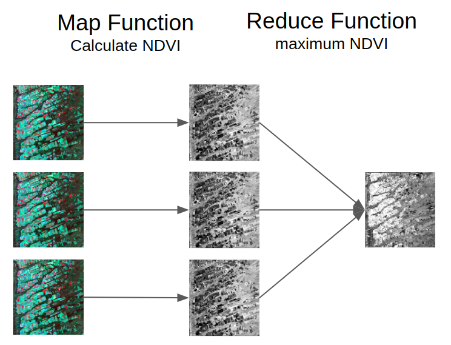

# Geospatial MapReduce



### Install Gdal
Get gdal development libraries:
```shell script
$ sudo apt-add-repository ppa:ubuntugis/ubuntugis-unstable
$ sudo apt-get update
$ sudo apt-get install libgdal-dev
$ sudo apt-get install python3-dev
$ sudo apt-get install gdal-bin python3-gdal
```

## Install virtual enviroment
```shell script
$ sudo apt-get install virtualenv
```

### Create and activate a virtual environment
```shell script
$ virtualenv env -p python3
$ source env/bin/activate
```

### Install Numpy
```shell script
(env)$ pip3 install numpy==1.17.4
```

### Install GDAL Python lib
```shell script
(env)$ pip3 install GDAL==$(gdal-config --version) --global-option=build_ext --global-option="-I/usr/include/gdal"
```

### Install Requirements
```shell script
(env)$ pip3 install -r requirements.txt
```

### Dataset
[Download link](https://drive.google.com/drive/folders/1TZWfhc6KJYfkB58FXdp-DzxPJA6ZaSgT?usp=sharing)

```shell script
mkdir data/
ls data/
    LC08_220069_20190213.tif
    LC08_220069_20190520.tif
    ...
```

### Execute
```shell script
(env)$ python3 main.py
```
